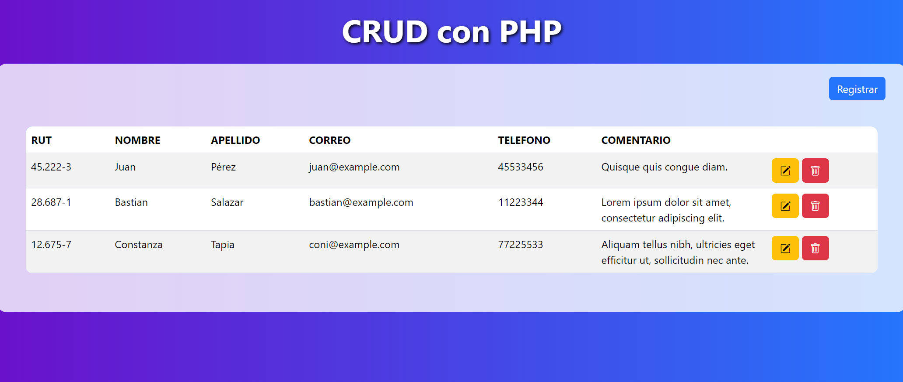
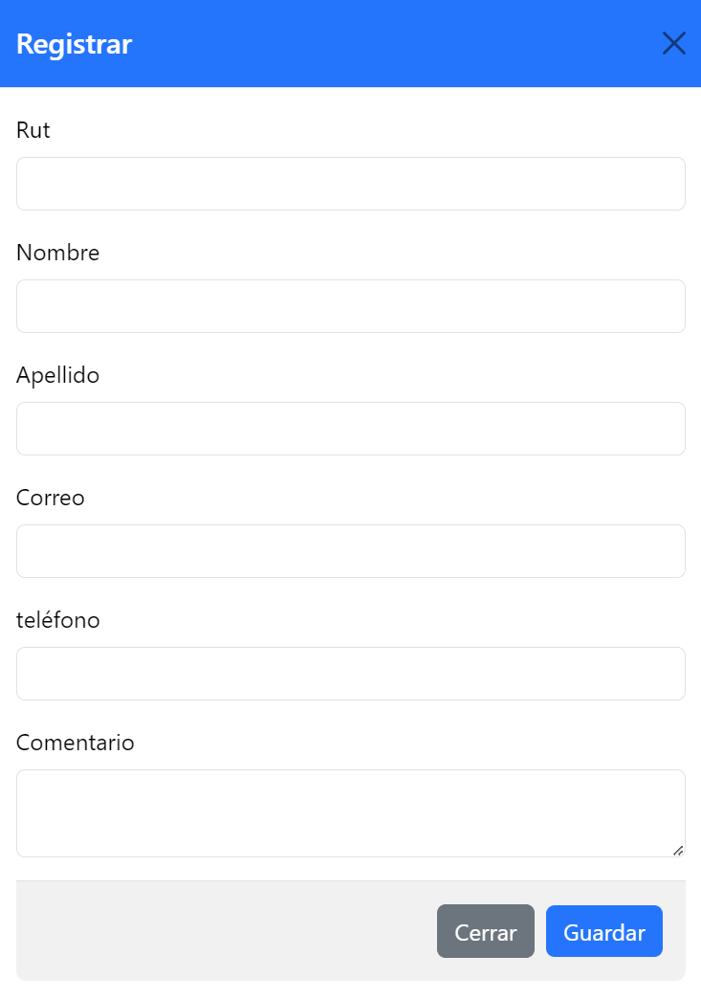
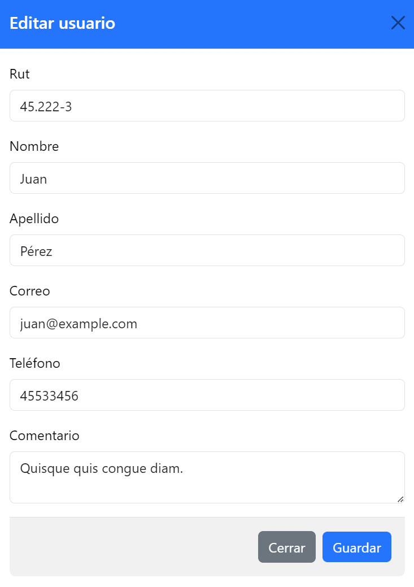
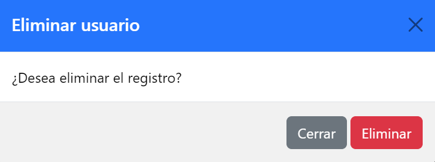

# CRUD con PHP

## Descripción

Este proyecto es un CRUD (Crear, Leer, Actualizar, Eliminar) desarrollado en PHP que te permite gestionar registros de usuarios de manera sencilla. La página principal muestra una lista de usuarios y te permite ver detalles, editar y eliminar usuarios utilizando modales para una experiencia de usuario más fluida.

## Estructura del Proyecto

- `Controlador/`:  Contiene las acciones relacionadas con la gestión de usuarios, como mostrar la lista de usuarios, crear un nuevo usuario, editar usuario y eliminar usuario.
- `Modelo/`: Contiene la lógica de acceso a la base de datos.
- `README.md`: Descripción del proyecto e instrucciones.

## Funcionalidades

- Visualización de Registros: En la página principal del proyecto, se muestra una lista de usuarios registrados en la base de datos.


- Creación de Usuarios: Se proporciona un formulario para agregar nuevos usuarios al sistema.


- Edición de Usuarios: Cada usuario en la lista tiene la opción de ser editado. Al hacer clic en el botón de edición, se abre un modal con el formulario prellenado con los datos del usuario seleccionado.


- Eliminación de Usuarios: Se puede eliminar un usuario haciendo clic en el botón de eliminación asociado al usuario en la lista. Se muestra un mensaje de confirmación antes de proceder con la eliminación.


## Instalación

Para ejecutar este proyecto en tu entorno local, sigue estos pasos:

1. Requisitos Previos:
- Asegúrate de tener instalado un servidor web local (como XAMPP, WAMP o MAMP) que admita PHP y MySQL.
- Necesitarás un navegador web moderno como Opera, Chrome o Edge.

2. Clonar el Repositorio:
- Abre tu terminal o línea de comandos.
- Navega hasta la ubicación donde deseas clonar el repositorio.
- Ejecuta el siguiente comando para clonar el repositorio:
```bash
git clone https://github.com/bsalper/crudphp.git
```

3. Configuración de la Base de Datos:
- Crea una base de datos MySQL en tu servidor local.
- Importa el archivo de base de datos crud.sql que se encuentra en el directorio del proyecto. Este archivo contiene la estructura de la tabla de usuarios.

4. Configuración del Proyecto:
- Abre el archivo conexion.php en la carpeta "Modelo" del proyecto.
- Modifica las constantes DB_HOST, DB_USER, DB_PASS y DB_NAME con los detalles de tu servidor MySQL.

5. Ejecutar el Proyecto:
- Inicia tu servidor web local.
- Abre un navegador web y navega a la URL donde has colocado el proyecto.

## Uso

1. Inicio: Al acceder al proyecto, se muestra una lista de usuarios registrados. Desde aquí, puedes ver, editar o eliminar usuarios.

2. Crear Nuevo Usuario:

- Haz clic en el botón "Registrar".
- Completa el formulario con los datos del nuevo usuario.
- Presiona el botón "Guardar" para añadir el usuario a la lista.

3. Editar Usuario:

- En la lista de usuarios, haz clic en el icono "Editar" del usuario que deseas modificar.
- Se abrirá un modal con el formulario prellenado. Realiza los cambios necesarios.
- Presiona el botón "Guardar" para actualizar los datos del usuario.

4. Eliminar Usuario:

- En la lista de usuarios, haz clic en el icono "Eliminar" del usuario que deseas borrar.
- Se mostrará un mensaje de confirmación.
- Si estás seguro, confirma la eliminación y el usuario será eliminado de la lista.
